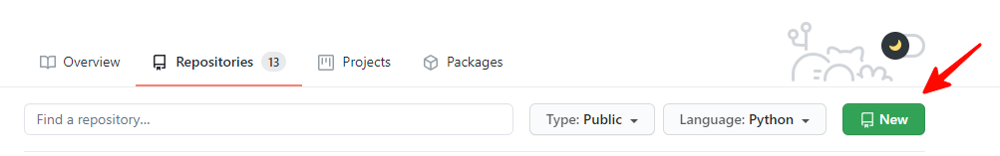
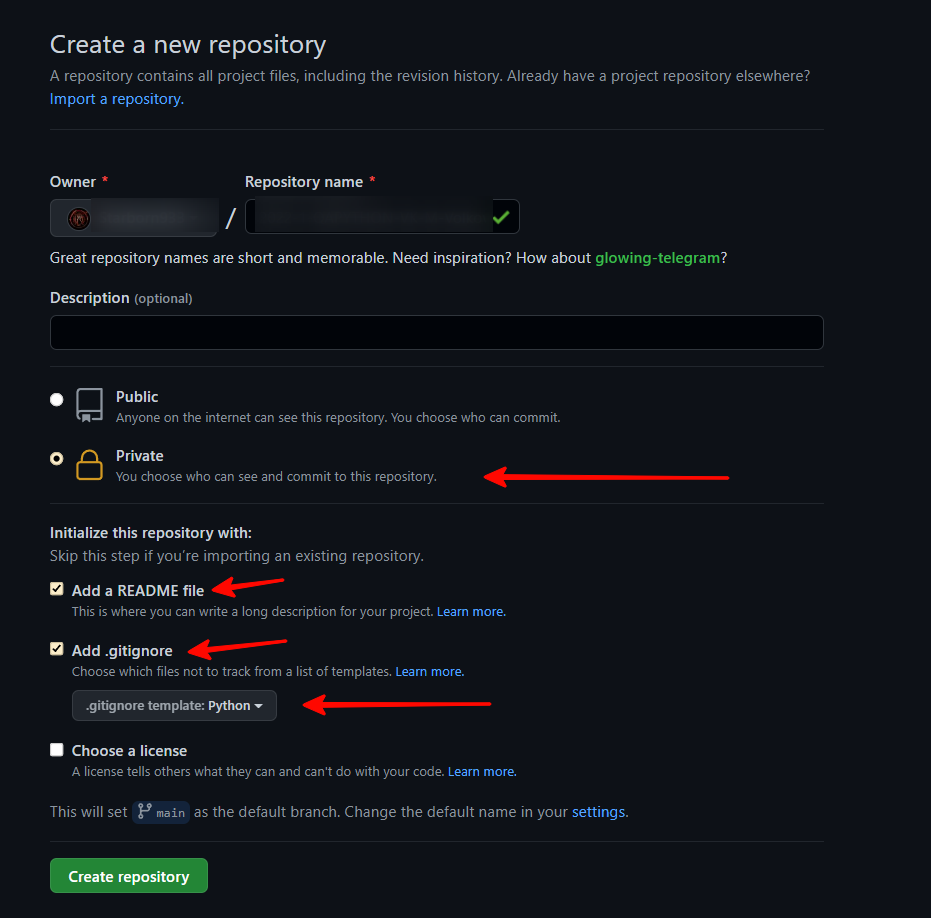
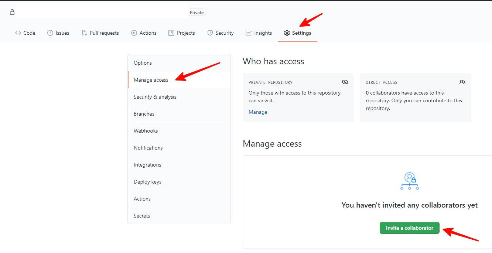
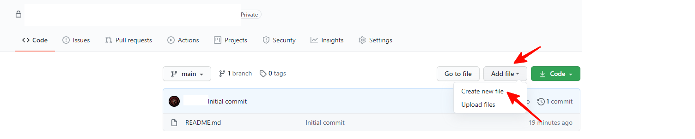
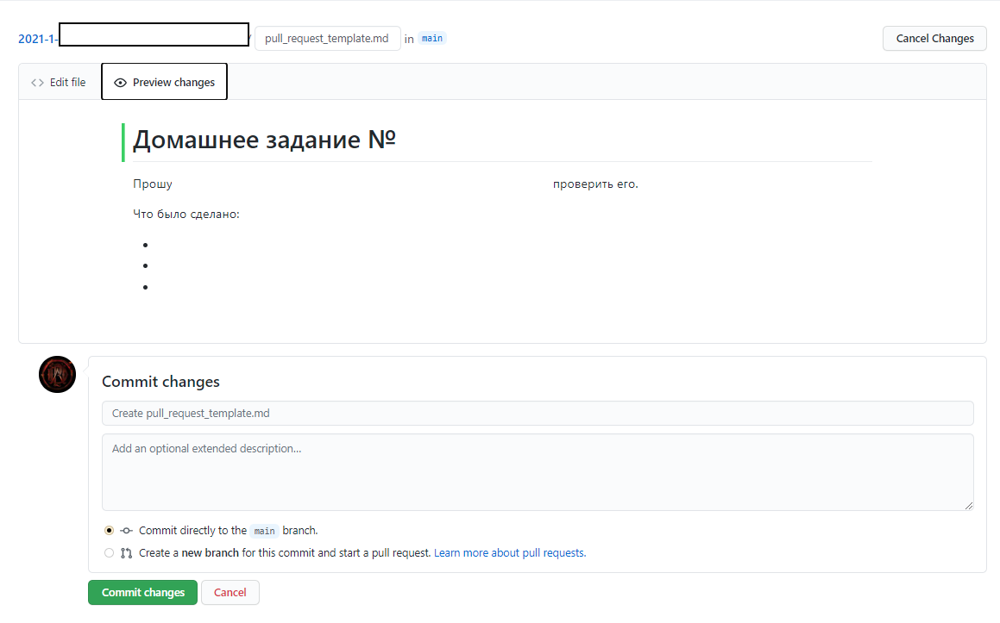
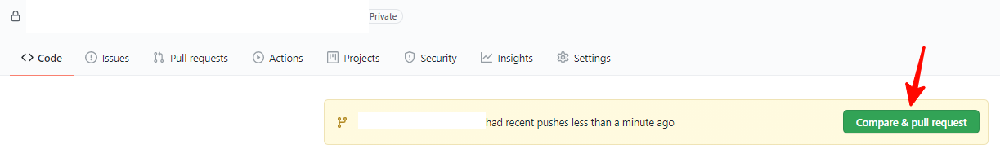
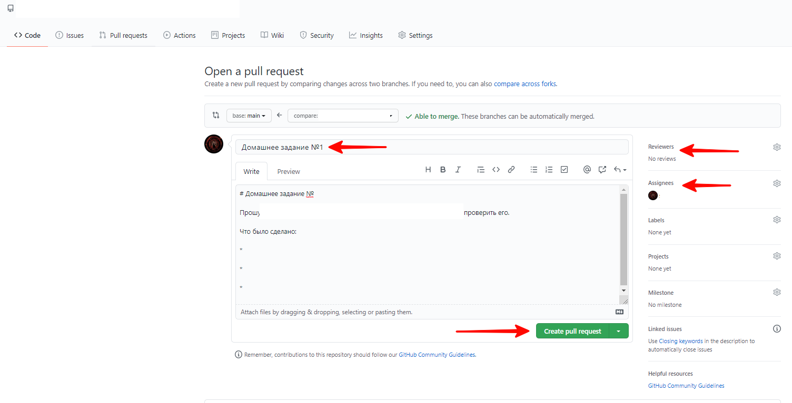
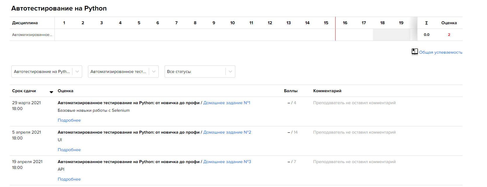

# Домашние задания курса "Автоматизированное тестирование"

### Инструкция по рабочему процессу с ДЗ

### 1. Создаем репозиторий
* Создаем новый репозиторий на [GitHub](https://github.com/new) или нажимаем на кнопку New в списке репозиториев:



### 2. Настраиваем репозиторий
* Создаем имя репозитория по следующему шаблону:

`YYYY-HALF_YEAR-QAPYTHON-VK-N-LAST_NAME`, где:

`YYYY` - год

`HALF_YEAR` - половина года, т.е. `1`, если сейчас `янв-июн`, или `2`, если `июл-дек`.

`N` - первая буква имени, `LAST_NAME` - фамилия.

Например, `2022-1-QAPYTHON-VK-M-Volkov`.

Пожалуйста, проверьте дважды правильность имени вашего репозитория, это облегчит работу по проверке и оценке ваших работ.

* Обязательно выберите тип репозитория - **Private**.

Пример описанных настроек представлен на изображении ниже: 
  


* После окончания курса все репозитории можно будет вернуть в Public-режим и предоставлять на них ссылку в резюме при необходимости.

* Не забудьте добавить **.gitignore** как это сделано на скриншоте выше. Это позволит автоматически не добавлять в репозиторий временные файлы, создаваемые IDE или pytest'ом в папке проекта.
В случае, если вы используете IDE, отличную от PyCharm, **вам необходимо самостоятельно** добавить все форматы создаваемых вашей IDE временных файлов.
  
* Ссылку на ваш GitHub-аккаунт и учетную запись в Telegram добавляете в список соц.сетей на [портале education.vk.company](https://education.vk.company/cabinet/settings/additional_info/). Если вы этого не сделаете - к вам придут в ЛС и попросят это сделать.
  
### 3. Добавляем преподавателей и менторов в коллабораторы
 * Заходим в настройки репозитория (/settings/access).
 * Добавляем `Starborn933`, `onimocity`, `doomwastaken`, `rayneraido`, `ksoldatov`, `KanyeEasttt`, `ThisIsUniqueUsername`, `demosfene` в collaborators. Проверьте обязательно итоговый список коллабораторов.

 Нам придут приглашения, перед сдачей ДЗ нужно будет дождаться, пока мы их примем. Если инвайт не был принят спустя неделю, вы можете написать об этом преподавателю в Telegram.

Пример представлен на рисунке ниже:



### 4. Создаем шаблон для Pull Request
* Создаем файл с именем `pull_request_template.md` в корне проекта.
* Содержимое должно быть следующим:
```md
# Домашнее задание №

Прошу @Starborn933, @onimocity, @doomwastaken, @rayneraido, @ksoldatov, @KanyeEasttt, @ThisIsUniqueUsername, @demosfene проверить его.
Что было сделано:

*

*

*

```

Это шаблон для ваших `PR (Pull Request)`, в котором есть упоминания всех преподавателей (для получения уведомлений). Сам файл при сдаче ДЗ редактировать не нужно. Вместо этого, при создании `PR` нужно в `GitHub` коротко описать проделанную работу.




### 5. Правила сдачи ДЗ
* Для всех ДЗ используется один репозиторий.
* В одном Pull Request сдается только **одно** ДЗ.
* Каждое ДЗ делается в отдельной ветке и папке, чтобы избежать возможных конфликтов при мерже. В случае, если при создании PR происходит конфликт веток, вам необходимо самостоятельно закрыть Pull Request и решить конфликт. 
* Папка для каждого должно называться в формате `homeworkN` - например, `homework3`. **ЭТО КРАЙНЕ ВАЖНО!**
*  В папке должен лежать conftest и иные необходимые папки и файлы, без лишней вложенности (типа homework3/code/conftest.py -> `нужно homework3/conftest.py`).
  
  Удостоверьтесь, что вы не загрузили результирующий код вашей домашки в ветку `main`. В корне ветки main должны находиться файлы: 
`README.md`, `.gitignore`, `pull_request_template.md` и [обновляемый во время каждой ДЗ requirements.txt](https://pip.pypa.io/en/stable/user_guide/), а также папки с вашими предыдущими домашками (если таковые имеются), которые были добавлены в результате одобрения Pull Request преподавателем.
  В дальнейших домашках мы можем попросить вас добавить готовый файл для CI GitHub Actions.
* Каждая ветка, из которой делается PR, должна быть синхронизирована с `main`. Создание новых веток для домашек необходимо выполнять после полной синхронизации локального кода с кодом из репозитория в ветке main. Затем, от последнего коммита, нужно делать новую ветку. **После этого в ветку `main` вносить изменения запрещено.**
Процесс синхронизации с помощью команд Git может быть разным, ниже представлен пример списка команд для синхронизации ветки main:
  ```
  1. git checkout main -> этой командой вы производите переход с ветки для 
  домашки на ветку main
  2. git pull -> этой командой вы производите синхронизацию вашего локального
   и удаленного репозитория
  3. git checkout -b <Ваше название ветки> -> этой командой вы создаете новую ветку
  ```
 

### 6. Сдаем ДЗ на проверку
* Создаем новую ветку в формате
`homeworkN`, где:
`N` - номер домашнего задания. Например: homework3. **Это КРАЙНЕ ВАЖНО.**
* После выполнения домашнего задания, создаем Pull Request в ветку `main`.
  
* Добавляем `Starborn933`, `onimocity`, `doomwastaken`, `rayneraido`, `ksoldatov`, `KanyeEasttt`, `ThisIsUniqueUsername`, `demosfene` в поля `reviewers` и `assignee`. Каждый логин должен отображаться в выпадающем списке.
* В теме **обязательно** пишем номер ДЗ, в описании опционально пишем то, что сделано.
* Нажимаем на кнопку `Create pull request`. Создастся Pull Request, ссылку на который вы должны отправить в качестве ответа на домашнее задание через портал `https://education.vk.company/`.
Ссылку на PR можно взять в адресной строке браузера, например `https://github.com/username/2022-1-QAPYTHON-VK-M-Volkov/pull/1`



* После создания PR вам необходимо зайти на портал [education.vk.company](https://education.vk.company/), нажать на иконку своего профиля (в правом верхнем углу), после этого откроется личный кабинет.
* Чтобы увидеть задания, которые нужно сдать, нажмите на вкладку Успеваемость. У вас откроется список домашних заданий:



* Подробное описание заданий представлено в репозитории курса на [GitHub](https://github.com/Starborn933/education-vk-python-2022). На портале же вы можете видеть все задания, которые нужно будет выполнить и дедлайн по ним, максимальное количество баллов и сможете отправить решение на проверку, нажав на нужное задание. На открывшейся странице будет кнопка "Отправить решение".
* Отправляя решение на проверку на портале, вы можете написать просто текст, например, “Задание выполнил, все загрузил в GitHub” и обязательно оставить ```ссылку на PR```.
* В поле "Преподаватели" выберите всех преподавателей и менторов курса: ```Волков Михаил, Константин Ермаков, Ольга Юрьева, Кирилл Солдатов, Константин Волков, Глеб Краснополин, Кирилл Матвеев, Алексей Фильчаков```.
* **Все обсуждение ваших домашек происходит внутри Pull Request**, обсуждение в чате на портале вести не нужно. Если у вас есть какие-то вопросы по формулировкам комментариев преподавателя или ментора, вы можете написать об этом ему в личку в Telegram.

### 7. Ожидаем проверки и вносим правки
 * С момента создания пулл-реквеста в него **запрещается** (!) вносить изменения, пока его не проверит преподаватель или ассистент.
 Внесение изменений после создания пулл-реквеста и до момента комментирования преподавателем автоматически уменьшает итоговый балл на 30%.
 * Если все выполнено корректно - преподаватель апрувит PR и выполняется мерж.
 * Если есть недочеты - будут оставлены замечания, которые надо будет быстро исправить и запушить в текущий PR. Мы их увидим и пересоздавать PR не нужно.
 * После исправления всех недочетов в PR необходимо оставить комментарий "Исправлено".

___

### 8. Критерии оценки ДЗ
* Для того, чтобы успешно сдать домашнее задание - нужно вовремя создать PR (до дедлайна домашки).
* Срок сдачи каждого задания - 1 неделя с момента его выдачи на лекции **(если иное не указано преподавателем на странице домашки)**. Например, если срок сдачи - неделя, а задание было выдано в среду на неделю, то дедлайн - до 23:59 среды следующей недели.
* Максимальной оценкой оценивается решение, которое было выполнено правильно с первого раза согласно критериям проверки.
* Если были допущены сильные недочеты, то баллы снижаются в зависимости от степени замечаний на усмотрение преподавателя
* Максимальное количество попыток сдачи ДЗ - 3 раза. Однако, дополнять домашнее задание теми частями, которых не было в изначальном PR - нельзя,
  допустимы только исправления ошибок, которые указаны преподавателями или менторами.
* Если после проверки вы на протяжении длительного времени не вносите изменения, задание будет оценено "как есть".
* Если Вы сдаете ДЗ после дедлайна, не сдаете вообще – ДЗ автоматически оценивается в 0 баллов и более не принимается. Исключения конечно же есть – это невозможность сдать ДЗ по строго уважительной причине, например болезни с предоставлением справки (в период короновируса это в целом довольно актуально) или вынужденном отъезде куда-либо.
* В случае, если вы по каким-то причинам добавляете свою домашку в ветку main без одобрения преподавателя, домашнее задание считается **автоматически проверенным Вами самостоятельно** и за него выставляется 0 баллов.
* Проверяться будет все, как степень выполнения ДЗ согласно ТЗ, так и кодовая база (то есть как вы реализовали ту или иную задачу). Поэтому стараемся избавляться от неэффективных и чрезмерно перегруженных конструкций, копипаст и т.д.
* Отдельно про git, этот момент тоже будет проверяться, а именно – наличие лишних файлов в ПР, кривая история (без использования rebase, например), неинформативные коммиты и т.д.
